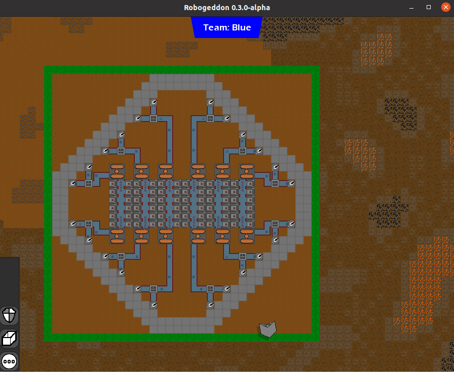
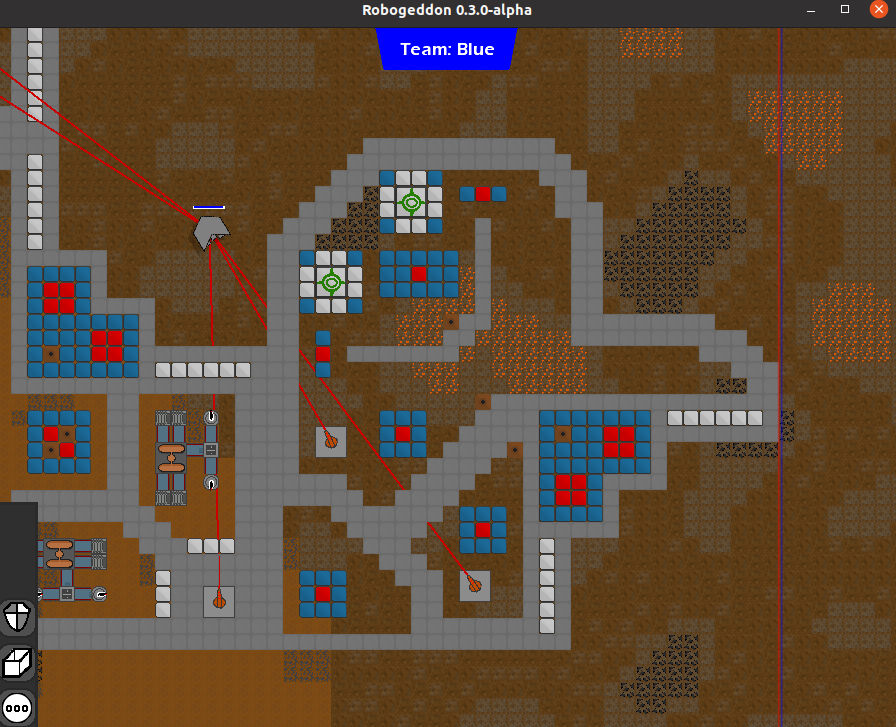
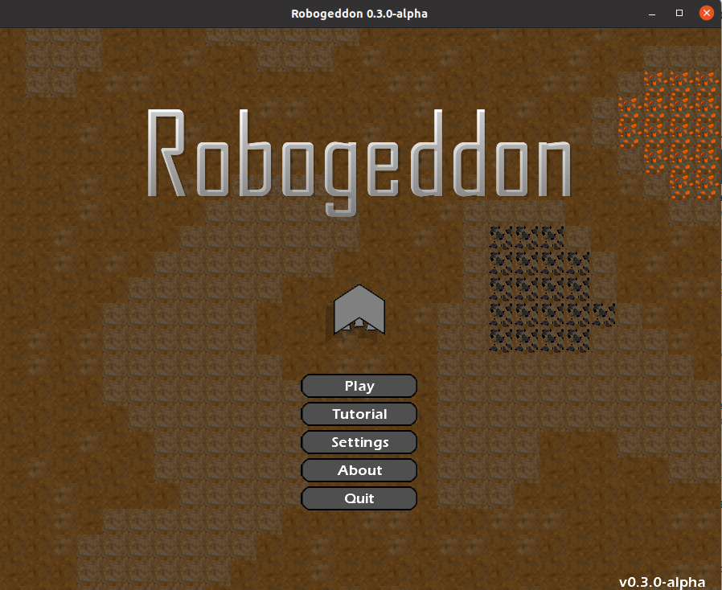

# Robogeddon
A Capture the Flag Game focused on resource automation

### Running the game
To run the client:
```
gradlew packSprites run
```

To run the server:
```
gradlew server:runServer
```

### Pictures





### Building an image
To build a Windows image (bundled JRE) simply run the following
```
gradlew client:runtime
```

The image will be in the client/build/image folder!